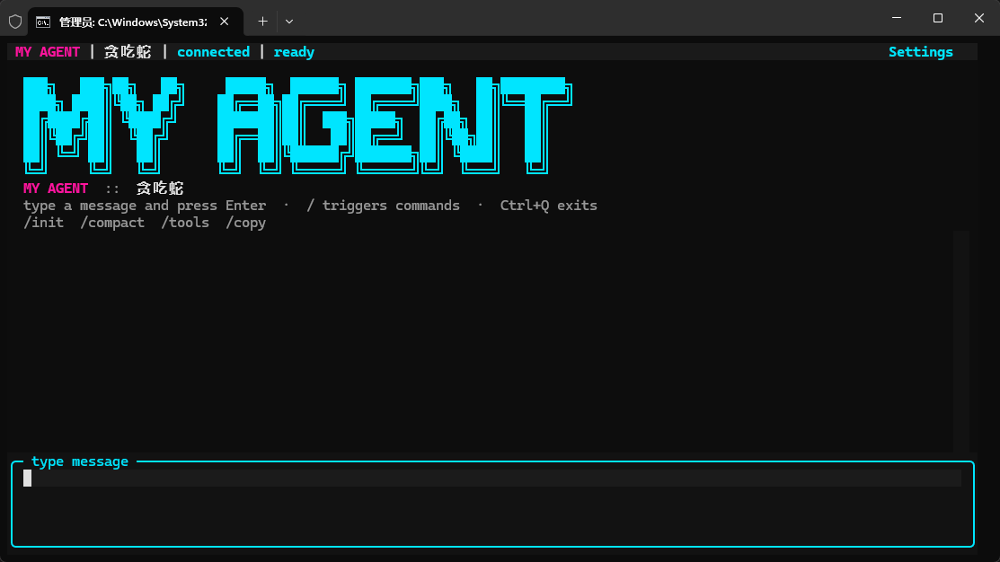
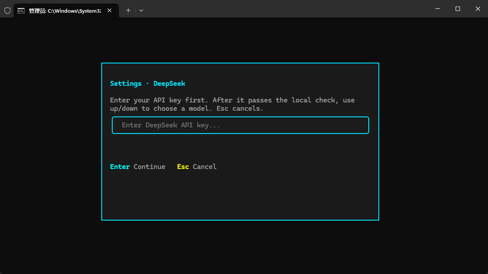
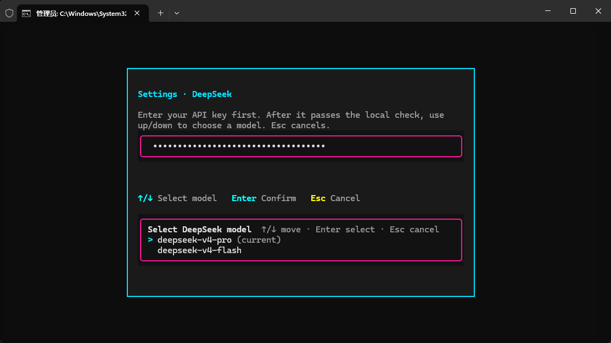
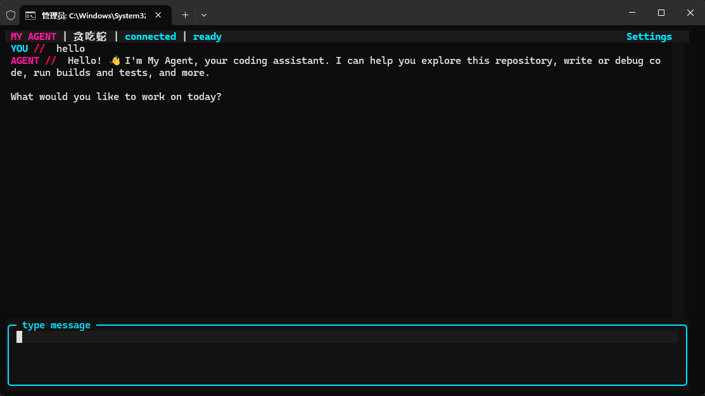
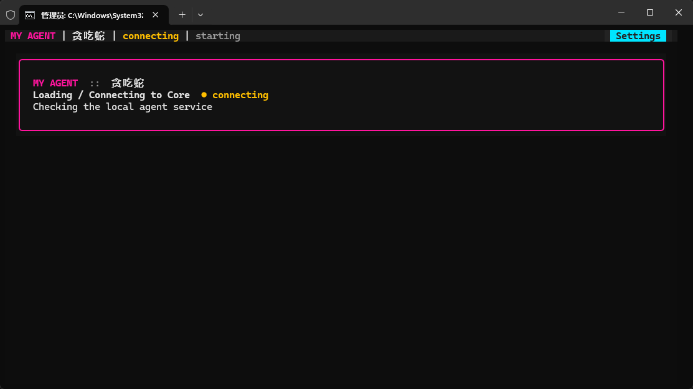
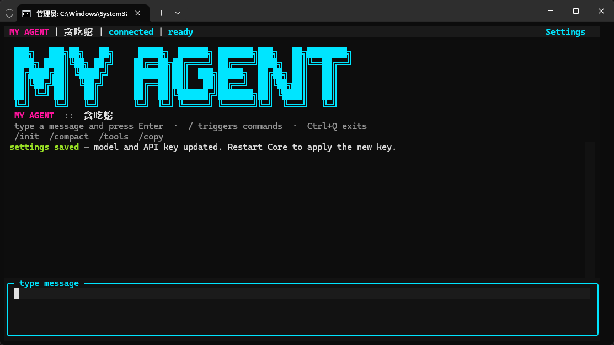
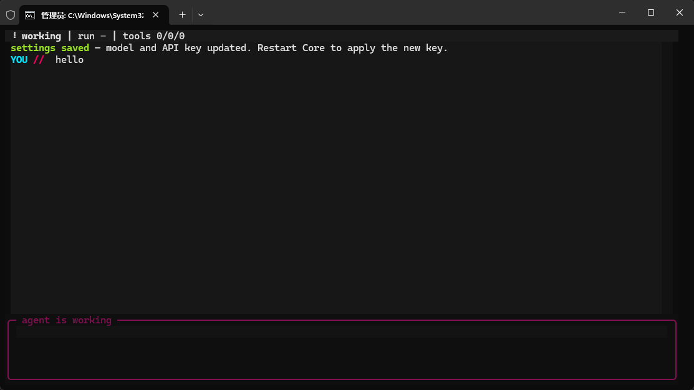

# Rookie Agent

[English](README.md) | [简体中文](README.zh-CN.md)

Rookie Agent 是一个在真实项目目录中工作的本地代码 Agent。它由后台 Core
进程和终端 UI／CLI 客户端组成，让会话、工具调用、权限和事件历史保持可观察、
可恢复。

公开产品名称是 **Rookie Agent**。为了保持兼容，当前命令行入口仍然是
`my-agent`、`my-agent-tui` 和 `my-agent-core`。

## 界面预览

连接成功，可以开始工作：



首次启动时配置 API Key 和模型：





Agent 返回结果：



<details>
<summary>查看更多截图</summary>







</details>

## Windows 安装

推荐通过固定版本的 GitHub 安装脚本进行安装。请在 PowerShell 中运行：

```powershell
irm https://raw.githubusercontent.com/CIA-Dao/rookie-agent/v0.0.2/scripts/install.ps1 -OutFile install-rookie-agent.ps1
.\install-rookie-agent.ps1 -Version v0.0.2
Remove-Item .\install-rookie-agent.ps1
```

如果 PowerShell 因执行策略阻止脚本，请在当前 PowerShell 窗口中临时允许脚本，
然后重新运行安装命令：

```powershell
Set-ExecutionPolicy -Scope Process Bypass
```

这个设置只对当前 PowerShell 进程生效，关闭窗口后自动失效。不要修改整台机器的
执行策略。

安装器会在需要时自动安装 `uv`，从 GitHub 的固定版本归档进行非 editable 安装，
更新当前用户的 PATH，并验证命令是否可用。用户不需要预先安装 Git、Python、
`uv`，也不需要手动创建虚拟环境或配置 `.env`。安装器不会要求、读取或处理 API
Key。

安装器会保守处理已有安装：

- 没有已安装工具：直接安装 Rookie Agent；
- 已有非 editable 的 `rookie-agent`：执行升级，失败时恢复之前的安装来源；
- 已有非 editable 的旧 `my-agent`：先预检新包，再迁移工具，失败时尝试恢复旧版本；
- 已有 editable 开发安装：停止安装，不覆盖开发环境；
- uv 工具目录之外存在同名命令：停止安装并报告 PATH 冲突。

用于隔离测试时，`-SkipPathUpdate` 可以避免把临时 uv 工具目录写入用户 PATH。
普通安装不要使用这个参数。

也可以在已检出的源码目录中运行安装脚本：

```powershell
.\scripts\install.ps1 -Version v0.0.2
```

安装完成后，关闭当前终端并重新打开 PowerShell，然后运行：

```powershell
my-agent
```

首次启动时，TUI 会要求填写 DeepSeek API Key 并选择模型。API Key 只保存在本机
的 `~/.my-agent/.env` 中，不会出现在安装参数或仓库文件里。

## 开发环境

本地开发需要 Python 3.12 和 uv：

```powershell
uv sync --dev
uv run my-agent
```

常用验证命令：

```powershell
uv run pytest -q
uv run ruff check src tests
uv run mypy src
```

## 架构

```text
my-agent CLI / TUI
        |
        | 通过 TCP 传输本地 JSON-line RPC
        v
my-agent Core
        |
        +-- 会话和运行记录
        +-- 工具与权限
        +-- AgentRunner 和 AgentLoop
        +-- 事件与追踪记录
```

Agent 会以启动命令时所在的项目目录作为工作目录。运行日志和会话数据属于本地
产物，不应提交到 Git。

## 当前发布范围

当前版本支持 DeepSeek，并提供 `deepseek-v4-pro` 和 `deepseek-v4-flash` 两个
模型选项。PyPI 和 Node 包分发属于后续发布渠道，不是当前 GitHub 安装方案的
前置条件。

## 安全

不要提交 `.env`、API Key、Token、运行日志或本地配置。报告安全问题时请私下
联系项目维护者，不要在 Issue 中包含任何凭据。
